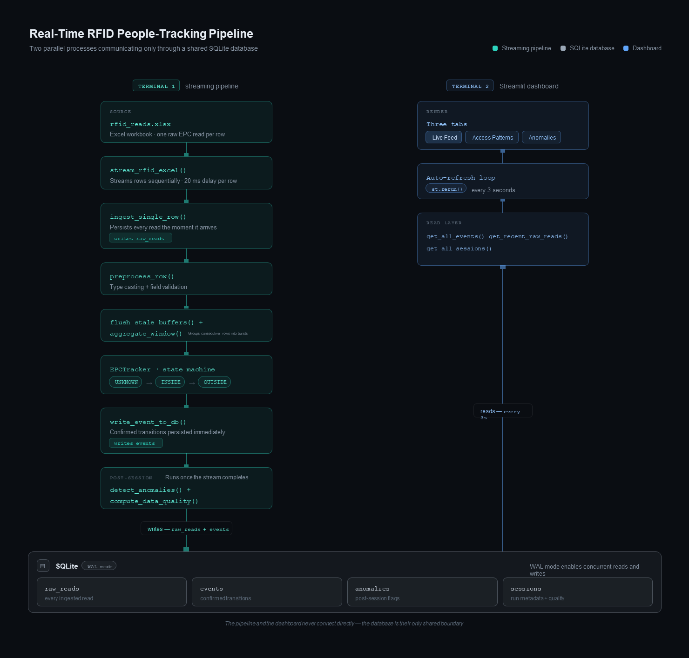

# Real-Time People Tracking: RFID Pipeline

A real-time system that processes raw RFID data to detect and analyze
people's entry and exit events from a building.

---

**Table of contents**

- [Tech stack](#tech-stack)
- [How to run](#how-to-run)
- [Output files](#output-files)
- [Viewing the database](#viewing-the-database)
- [Architecture](#architecture)
- [Detection algorithm](#detection-algorithm)
- [Anomaly detection](#anomaly-detection)
- [Dashboard](#dashboard)
- [Machine learning](#machine-learning)

## Tech Stack

- `openpyxl`: reads raw RFID data directly from Excel 
- `sqlite3`: built-in Python library used for all database reads and writes
- `pandas`: data manipulation in the ML notebook and dashboard data loading
- `streamlit`: dashboard framework, auto-refresh, and interactive widgets
- `plotly`: bar charts, histograms, and data quality visualizations in the dashboard
- `scikit-learn`: StandardScaler for feature normalization, IsolationForest for anomaly scoring
- `matplotlib` + `seaborn`: visualizations in the ML exploration notebook

## How to run

### 1. Clone the repository

```bash
git clone https://github.com/joudabihaidar/rfid-stream-pipeline.git
cd rfid-pipeline
```

### 2. Install dependencies

```bash
# Option A — UV (recommended)
uv sync

# Option B — pip
pip install -r requirements.txt
```

Requires Python 3.12+.

### 3. Run the pipeline

**Streaming mode**: processes data row by row at 20ms per row,
simulating a live RFID stream. Recommended for the demo.

```bash
# Terminal 1: start the pipeline (~31 seconds for all 7 sessions)
python -m src.main --stream

# Terminal 2: start the dashboard
streamlit run dashboard/app.py
```

Open `http://localhost:8501` in your browser.
Enable the **Auto-refresh** toggle in the sidebar to see events
appear in real time as the algorithm detects them.

**Batch mode**: processes everything at full speed (~2 seconds).

```bash
python -m src.main
streamlit run dashboard/app.py
```

> **Note:** To reset and reprocess from scratch, delete the database
> first: `del data\rfid_events.db` (Windows) or `rm data/rfid_events.db` (Mac/Linux).

---

## Output files

After the first run, two files are created in the `data/` directory:

| File | Description |
|---|---|
| `data/rfid_events.db` | SQLite database: all raw reads, events, anomalies, and sessions |
| `data/pipeline.log` | Full pipeline log with timestamps |

---

## Viewing the database

Download **DB Browser for SQLite** (free):
https://sqlitebrowser.org/dl/

1. Open DB Browser
2. Click **Open Database**
3. Navigate to `rfid-pipeline/data/` and select `rfid_events.db`
4. Click the **Browse Data** tab and select a table from the dropdown

Four tables are available: `raw_reads`, `sessions`, `events`, `anomalies`.

## Architecture

- The system streams raw RFID reads from an Excel workbook row by row,
simulating a live hardware stream. Each read is immediately persisted to a SQLite database, then fed through a custom detection algorithm that groups reads into bursts, filters ghost reads, and confirms entry/exit events using a state machine. 
A Streamlit dashboard reads from the same database in parallel, refreshing every 3 seconds to show events appearing in real time as the algorithm detects them.

- The system runs as two parallel processes connected only through a shared
SQLite database with WAL mode enabled, allowing the pipeline to write
and the dashboard to read simultaneously without locking.



## Detection Algorithm

Raw RFID data arrives as individual antenna reads, one row every time a reader picks up a tag. A single door crossing generates dozens of these rows.
The algorithm's job is to collapse that noise into meaningful events: ENTRY, EXIT, and ZONE_TRANSITION.

### Step 1: Grouping reads into bursts

Rows are grouped by `(epc, reader, direction)`: same person, same reader, same direction. A group stays open as long as rows keep arriving within **3 seconds of each other**. The moment a gap larger than 3 seconds is detected, the group closes and becomes a burst.

The 3-second gap threshold was chosen because it matches the natural pause between a person moving away from one reader and approaching another.

When a group closes, it is aggregated into a single summary:
`count`, `peak_rssi`, `t0_start`, `t0_end`.

### Step 2: Three filters every burst must pass

Before the algorithm makes any decision, each burst passes three filters:

1. **Noise filter**: bursts with fewer than 3 reads are discarded.
   Too few reads to be a reliable detection.

2. **Ghost suppression**: Out bursts with `peak_rssi < -72 dBm` are
   discarded while the person is inside or in an unknown state. The outside reader can pick up weak signals through the wall when someone is standing inside near the door. This is a one-directional problem. In reads are never filtered this way because the inside reader's antenna points inward and cannot meaningfully detect someone standing outside.

3. **Duplicate filter**: In bursts are discarded if the person is already confirmed inside. Out bursts are discarded if already confirmed outside. A person cannot enter twice without exiting first.

### Step 3: Confirming exits (EPCTracker)

`EPCTracker` is a state machine with three states: `UNKNOWN → INSIDE → OUTSIDE`.

In bursts that pass all filters confirm an ENTRY and move state to INSIDE.
Out bursts that pass all filters are not immediately confirmed as an EXIT.
Instead the burst is held as a **pending exit** for up to 10 seconds.

If an In burst arrives within that window, the algorithm compares RSSI:
- `out_rssi ≤ in_rssi` → the Out was a ghost read. Discard it, confirm ENTRY only.
- `out_rssi > in_rssi` → the Out was genuine. Confirm EXIT then ENTRY.

If 10 seconds pass with no In burst, the exit is confirmed regardless.

### Step 4: Zone transitions (MovementTracker)

`MovementTracker` runs in parallel while the person is confirmed INSIDE.
It tracks the last reader that had a confirmed burst. When a new confirmed burst arrives from a different reader, a ZONE_TRANSITION event fires:

```
from_zone: Storage_In__Door1_Box1
to_zone:   Storage_In__Door2_Box1
t0:        t0_end of the new burst
```

On EXIT, the tracker resets and `current_zone` returns to None.

## Anomaly Detection

Two separate layers run after the detection algorithm completes each session.

**Rule-based anomalies** (`analytics/anomaly.py`): seven specific behavioral patterns flagged as anomalies:

| Type | Trigger |
|---|---|
| `EXIT_WITHOUT_ENTRY` | Exit confirmed with no prior entry |
| `SHORT_DWELL` | Dwell time below 10 seconds |
| `LONG_DWELL` | Dwell time above 120 seconds |
| `RAPID_REENTRY` | Entry within 30 seconds of a prior exit |
| `SESSION_ENDED_INSIDE` | Stream ended with person still confirmed inside |
| `SIMULTANEOUS_TRANSITIONS` | Two zone transitions at the same T0 |
| `OUT_READS_NO_IN_READS` | A door has Out reads but no In reads at all |

**Data quality metrics** (`analytics/quality.py`): stored on the sessions row, not in the anomalies table. These are not behavioral anomalies but diagnostic signals about how reliable the events are:

- `ghost_read_ratio`: Out reads while confirmed inside / total reads.
Higher means noisier signal environment.
- `entry_rssi_strength`: peak RSSI during the entry burst, categorized as strong (≥ -65 dBm), moderate (≥ -70 dBm), or weak (< -70 dBm).

---

## Dashboard

Three tabs, all reading from the SQLite database. When the streaming
pipeline is running in a separate terminal, enabling **Auto-refresh**
in the sidebar causes the dashboard to reload every 3 seconds.

**Live Feed**: two side-by-side tables: raw RFID reads on the left
(arriving row by row from `raw_reads`) and confirmed events on the right (appearing the moment the algorithm detects them). Four live metrics: currently inside, total entries, total exits, anomalies flagged.

**Access Patterns**: session-level analytics:
- Entries and exits per session (bar chart)
- Door usage: which doors used for entry vs exit (bar chart)
- Dwell time distribution (histogram)
- Zone transition paths (table)
- Ghost read ratio per session colored by entry signal strength (bar chart)

**Anomalies**: rule-based detection results:
- Anomaly counts by type (bar chart)
- Anomalies per session (bar chart)
- Session overview with ghost ratio, entry signal, and anomaly flag
- Full anomaly log with human-readable notes

---

## Machine learning

An exploratory Isolation Forest model is built in `notebooks/exploration.ipynb`
as a complement to the rule-based anomaly detection layer. Rather than catching specific known patterns, it scores each session by how unusual it is across all features simultaneously, flagging sessions that deviate from the norm without fitting any single rule.

**Why Isolation Forest:** unsupervised, no labeled data required. Scores sessions by how easily they can be isolated from the rest using random feature splits. Sessions that stand apart require fewer splits and score higher.

**Feature matrix**: nine features per session from two sources:

*From sessions/events:* `dwell_time`, `total_transitions`, `ghost_read_ratio`, `has_anomaly`

*From raw_reads* (only possible because raw reads are persisted):
`peak_entry_rssi`, `rssi_slope_in`, `rssi_slope_out`, `read_density`,
`antenna_count`

Using raw_reads features directly, rather than the categorical labels derived from them, preserves the full signal precision for the model.

**Production note:** this implementation trains on all available sessions and runs in inference-only mode. In a production system with a continuous stream, River's `HalfSpaceTrees` would replace it, an online learning equivalent that updates the model incrementally with each new session without retraining from scratch.